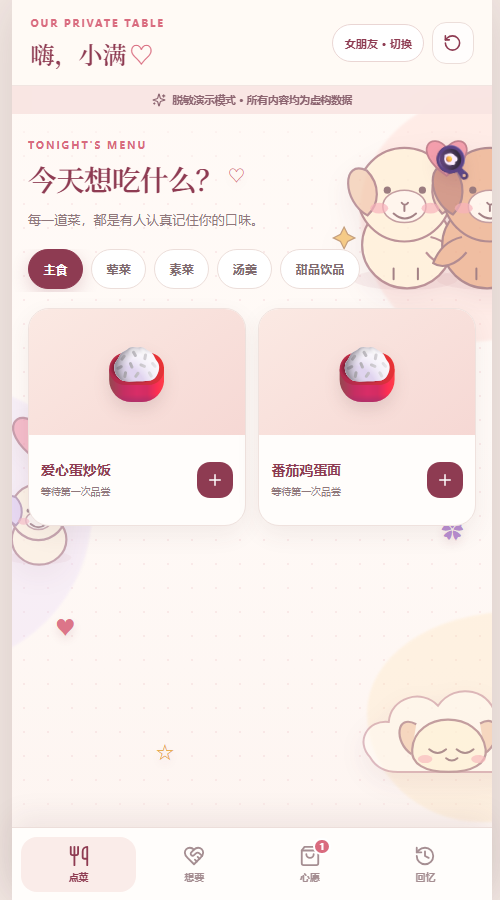
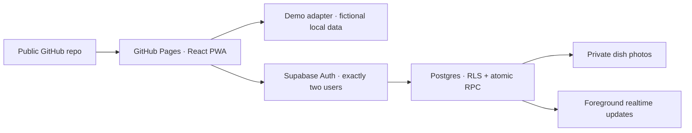

# 我们的私房菜单 · Our Private Menu

> 一款只属于两个人的手机 PWA：她把晚餐和抱抱放进同一张心愿单，他认真接单、下厨，也可以反过来发起甜蜜互动。

[](https://github.com/ovo1145141919810/couple-menu-pwa/actions/workflows/ci.yml)
[](https://github.com/ovo1145141919810/couple-menu-pwa/actions/workflows/pages.yml)

**在线体验：** `https://ovo1145141919810.github.io/couple-menu-pwa/`



## 为什么做这个项目

普通点菜软件优化的是交易，而这个项目优化的是两个人一起生活的感觉。菜品与“亲亲、抱抱、和好、打你”等互动可以出现在同一张心愿单里，却拥有彼此独立的状态流转。它既是一个真实可用的私人应用，也是一个公开、脱敏、可交互的个人作品集。

## 功能亮点

- 女朋友：分类点菜、份数、整单备注、撤回、逐道星级评价。
- 男朋友：实时接单、制作/上菜、菜品照片、分类与归档管理。
- 双方：发起自定义互动，可上传私人图片图标；兑现后可用一句话或另一个互动回礼，形成连续的甜蜜回应。
- 氛围：温柔奶油粉纯色背景、逐字页面标题和按钮点击火花。
- 回忆：已上菜、已兑现互动与评价自动组成时间线。
- 作品集 Demo：一键切换双角色，使用独立假数据，完全不访问生产数据。
- PWA：手机优先、可添加到桌面、前台实时通知、减少动态效果支持。

## 隐私优先的架构



公开仓库中没有真实邮箱、UUID、照片、订单或密钥。Demo 与真实模式实现同一个数据接口，但使用完全隔离的数据源。详细说明见 [Architecture](docs/ARCHITECTURE.md) 和 [Privacy](PRIVACY.md)。

## 技术栈

- React + TypeScript + Vite
- Supabase Auth / Postgres / RLS / Storage / Realtime
- Vitest + Testing Library + ESLint
- Vite PWA / Workbox
- GitHub Actions + GitHub Pages

## 本地运行

```bash
npm install
npm run dev
```

无需任何环境变量即可完整体验脱敏 Demo。真实模式需要复制 `.env.example` 为 `.env.local` 并连接 Supabase。

```bash
npm run lint
npm run test:run
npm run check:privacy
npm run check:production
npm run build
```

## 上线真实模式

正式模式代码已经包含双账号登录、最小数据库权限、RLS、原子状态流转、私有照片、断线回前台刷新和 Realtime。完整的一次性平台配置见 [Supabase 部署指南](docs/SETUP_SUPABASE.md)。女朋友不需要任何平台账号或编程软件，只需要应用链接与预设登录账号。

1. 创建免费 Supabase 项目并应用 `supabase/migrations/`。
2. 在 Dashboard 创建两个 Auth 用户，私下绑定 girlfriend/boyfriend 角色。
3. 给 GitHub Actions 配置项目 URL 与 Publishable Key 两个 Variables。
4. 将 GitHub Pages Source 设为 GitHub Actions，推送 `main` 自动发布。

## English summary

**Our Private Menu** is a mobile-first PWA for one couple. The girlfriend can order dishes and review them; the boyfriend receives and cooks those wishes. Both partners can also request small affectionate interactions. A mixed wishlist keeps food and affection on independent state machines.

The public portfolio Demo uses fictional browser-local data. Production records are protected by two-user Supabase Auth, Row Level Security, atomic database functions and private signed image URLs. No production identity or content is committed to this repository.

## Roadmap

- Optional system push notifications after the core two-person workflow proves stable.
- A user-triggered encrypted memory export for long-term personal backup.
- More install icons and a custom domain if the project graduates from the free tier.

## License

[MIT](LICENSE) — fictional Demo assets only; real couple content is never part of this repository.
