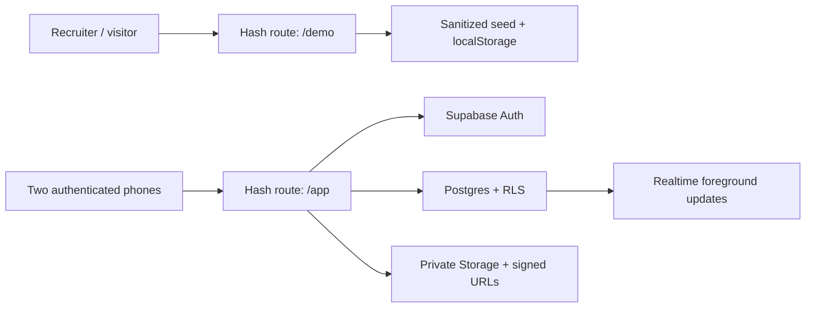
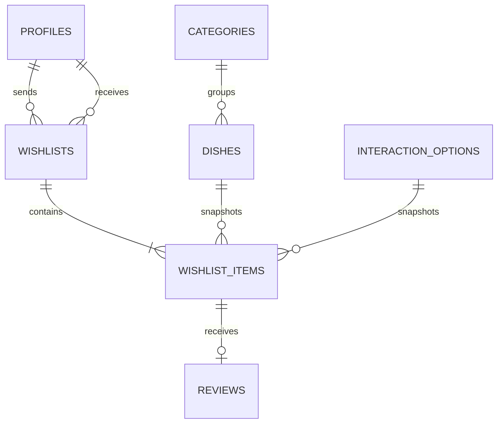
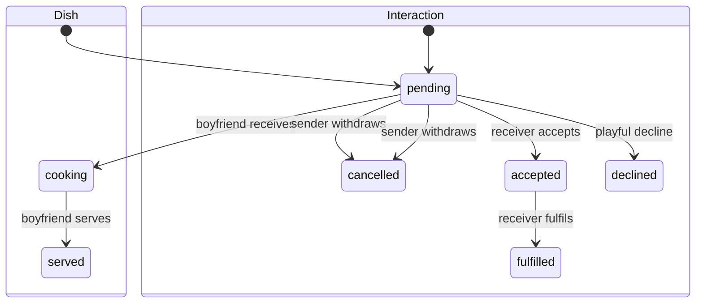

# Architecture & security notes

## Two isolated data paths

The demo adapter never imports, queries or copies production records. Both modes implement the same `AppRepository` interface so UI behavior can be demonstrated without weakening live authorization.

## Wishlist model

The batch is a presentation boundary. Each item has its own state machine, so a hug can be fulfilled while dinner is still cooking.

## Authorization invariants

- Public signup is disabled; two Auth users are mapped to the unique girlfriend/boyfriend roles.
- The publishable browser key grants no business data by itself. Every exposed table has RLS.
- Direct writes to wishlists, items and reviews are denied. Security-definer RPCs validate the caller, receiver and current locked row before changing state.
- Only the girlfriend may create dish items or review her served items.
- Only the boyfriend may manage dishes/categories or advance dish preparation.
- Either profile may request an interaction; only its receiver may answer or fulfil it.
- Custom interactions are editable only by their creator. System interactions are immutable.
- Dish photos and custom interaction icons stay in private buckets and are rendered through short-lived signed URLs. Interaction icon paths are snapshotted into wishlist history.
